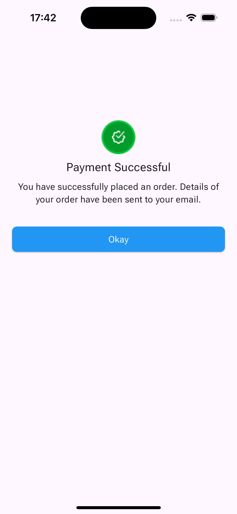

# success_page

## Overview

On an attempt to replicate the UI for my HNG task 3, I am creating a success screen which will be deployed to vercel, and navigated to when you checkout from my app -- the one I am buidling for the Task itself. So this is just an addition to differentiate my submission and stand out, I guess. 

## Screenshot

### Payment Successful Screen[Not sure why it's on the web though ]



### Home Screen

## Setup Instructions

### Prerequisites

- Flutter installed on your machine. Follow the instructions ([Test live here](https://appetize.io/app/b_fhq3l5zt3xt7natrel5fx32cb4)) to install Flutter.

### Steps

1. **Clone the Repository**

   ```sh
   git clone https://github.com/Immadominion/craft-my-plate.git
   cd simple_shopping_app
   ```

2. **Get Flutter Packages**

   ```sh
   flutter pub get

   ```

3. **Run the App**
   ```sh
   flutter run
   ```

<!-- ## Appetize Demo

- You can view a live demo of the app on Appetize.io ([here](would-add-link-here-soon)) -->

## Project Structure

```

    lib/
    |- main.dart
    |- core/
    |   |- constants/
    |   |    |- enum.dart
    |- data/
    |   |- model/
    |   |- controllers/
    |   |- local/
    |   |- services/
    |   |- types/
    |   |- presentation/
    |       |- screens/
    |       |- sections/
    |       |- widgets/
    |    |- dashboard.dart/
    |    |- splash.dart/
    |- utils/
    |- firebase_options_super_secret_intelligence.dart
    |- main.dart
```

## Code Overview

### Main file

- Main File (lib/main.dart): Contains the main entry point of the app, sets up navigation, and manages the state of the checkout list.
